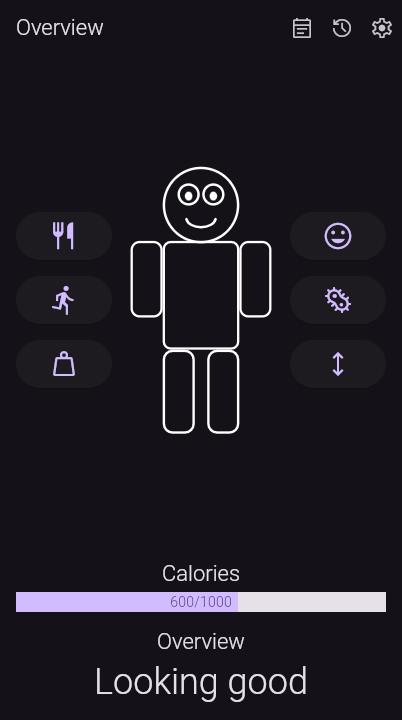
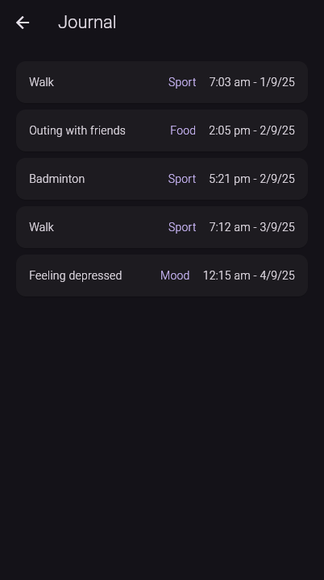
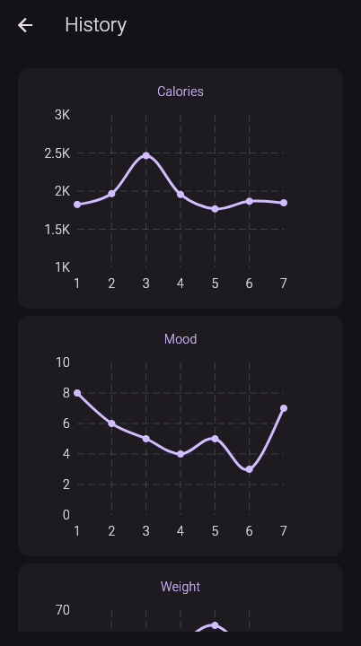
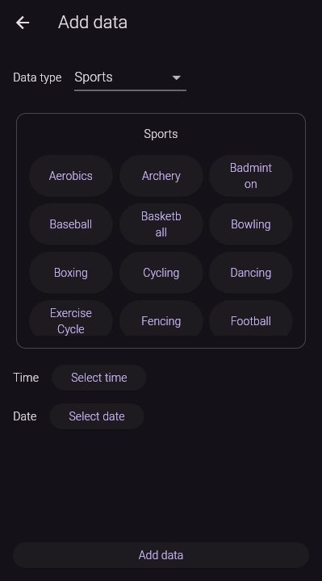

# Healthstat

Comprehensive health tracker made with Flutter

## Screenshots

    
    
    
    

## Features

The user will be able to input various details like calories, weight etc... from these data the app will calculate BMI and other data, from this an overall health score of the user is given

- Track calories
- Track sport activities
- Track mood
- Track weight and height
- Log diseases

# Libraries used
- flutter_svg
- material_symbols
- fl_chart

## To-do

- [X] Basic UI
- [ ] Basic functionality (adding data, removing data)
- [ ] Database storage (in app along with food list)
- [ ] History with graph
- [ ] Overview data calculation (like BMI)
- [ ] AI integration (to generate AI overviews and suggestions)
- [ ] Database storage (online syncing)
- [ ] Dynamic avatar (which changes according to health and mood)
